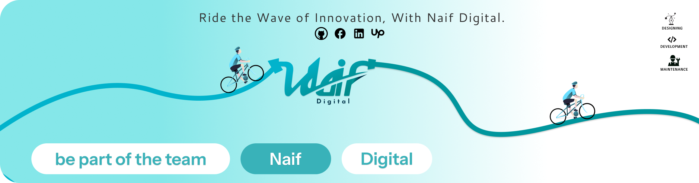

## Welcome to Naif Digital 🌊

### 🚴 Ride the Wave of Innovation with Naif Digital 🚴

Naif Digital is a forward-thinking organization dedicated to innovation, collaboration, and digital excellence. Join us as we push the boundaries of technology, empowering individuals and businesses to achieve more.

## 🌟 About Naif Digital

At Naif Digital, we are passionate about building cutting-edge solutions that transform ideas into reality. Our expertise spans across:

- **Web Development** Creating responsive, user-centric websites.
- **App Development** Building robust and intuitive mobile applications.
- **UI/UX Design** Delivering visually appealing and user-friendly designs.
- **AI and Machine Learning** Innovating with intelligent technologies.

## 🚀 Our Vision

To become a global leader in digital innovation, fostering creativity and delivering impactful solutions that reshape industries and improve lives.

## 🤝 Join Our Team

We believe in the power of collaboration. Whether you’re a developer, designer, or enthusiast, there’s a place for you at Naif Digital! Let’s create something extraordinary together.

## 📫 Connect With Us

Stay connected and up-to-date with our latest projects and announcements:

[Linkedin](https://linkedin.com/company/naifdigital)
[Telegram](https://t.me/naifdigital)

## 📜 License

naif digital follows the MIT License, ensuring our work remains open and accessible to everyone.